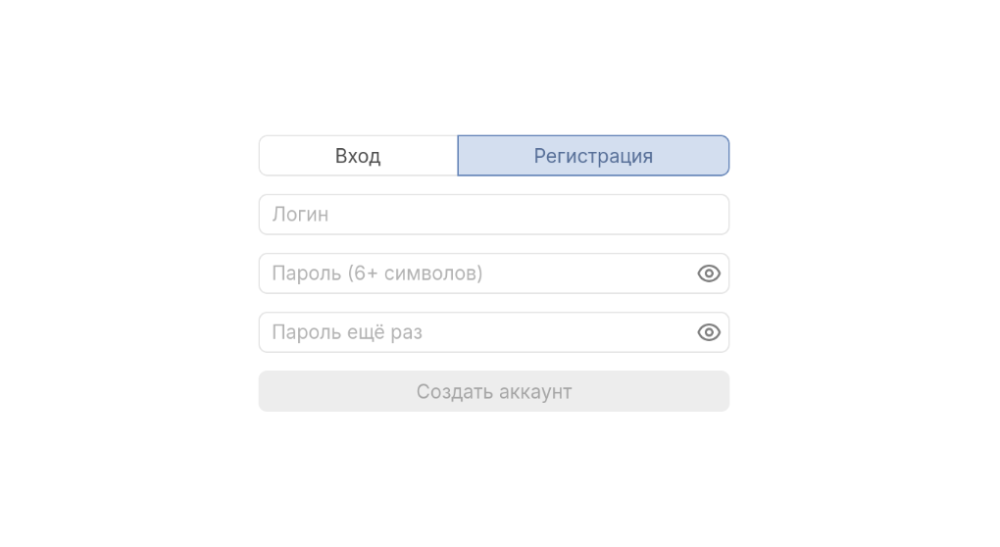
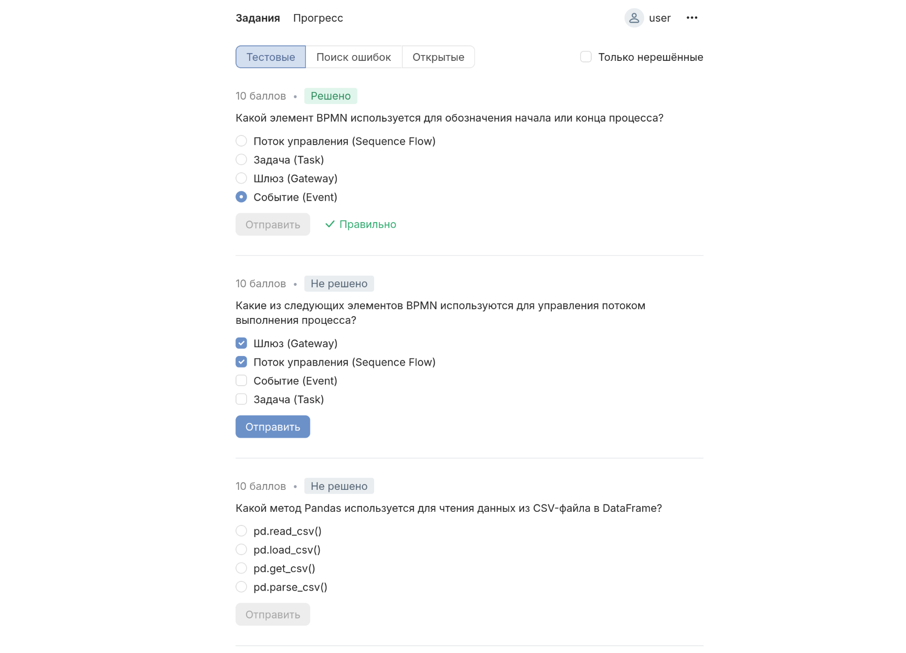
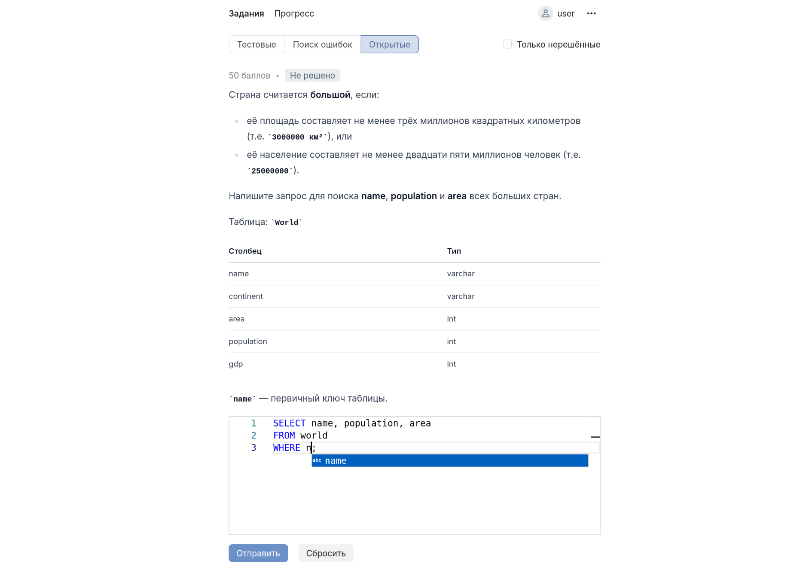
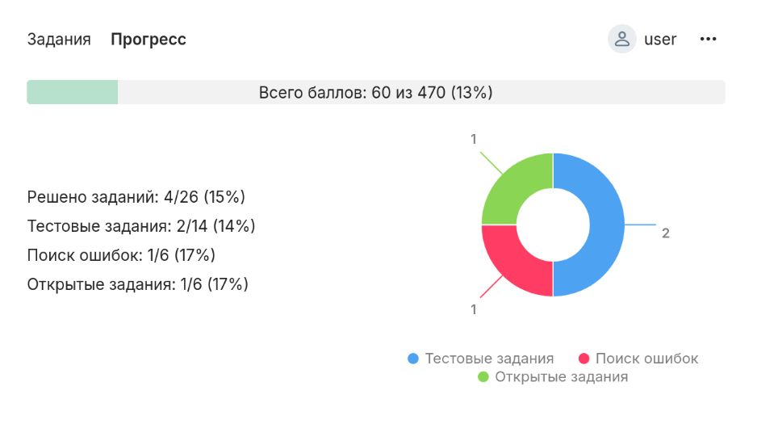
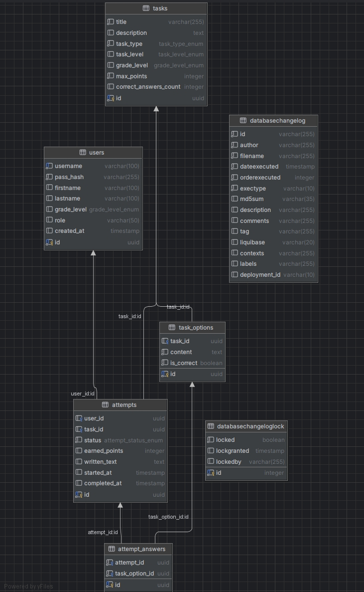

## Хакатон, кейс 1

Данный проект представляет собой Java-приложение, предназначенное для обучения и практики аналитических навыков через тестовые и открытые задачи.

Цель проекта — имитация реальной работы аналитика: пользователи проходят задания разных типов, система фиксирует результаты, начисляет баллы и ведёт прогресс обучения.

**Разработан прототип (MVP) бэкенд-сервиса, который обеспечивает следующие функции:**

1. регистрацию и аутентификацию пользователей (через JWT);



2. просмотр списка доступных тренажёров;

3. прохождение заданий пользователем

   Реализованы три вида заданий:
   - тестовые задания (один или несколько правильных ответов);

   
   - задания на поиск ошибок;

   - открытые задания (самостоятельная проработка артефактов).

   

4. фиксацию результатов выполнения заданий;

5. начисление баллов по единым правилам;

6. хранение и отображение прогресса пользователя в личном кабинете.



**Бизнес логика**

Алгоритм начисления баллов

1. Тестовые задания (много вариантов ответа)
   - Полный балл — если выбраны все правильные варианты без ошибок.
   - Нулевой балл — если выбран хотя бы один неправильный вариант.

2. Задачи на исправление ошибок
   - Полный балл — если ошибка исправлена верно.
   - Нулевой балл — если ошибка исправлена неверно.

3. Открытые задания
   - Полный балл — если дан верный ответ.
   - Нулевой балл — если дан неверный ответ.

4. Общие правила
   - Максимальный балл определяется в настройках задачи

Результаты выполнения заданий сохраняются, прогресс пользователя обновляется после выполнения заданий.

**Техническая реализация**

Реализована база данных, где хранится информация о пользователях, заданиях и результатах. Прогресс не хранится в отдельной таблице, а вычисляется на основе попыток решения задач. Это позволяет избежать избыточности и рассинхронизации данных (единый источник правды). Для решения использовался PostgreSQL.

Помимо основной БД имеется две вспомогательные таблицы, тк мы использовали в нашем технологическом стеке Liquibase.



**Основные сущности (Domain Models)**

User — профиль пользователя

Отвечает за хранение информации о пользователе системы: данные для авторизации.

TaskOption — вариант ответа для задачи

Используется только в задачах типа теста. Представляет отдельный вариант ответа, который пользователь может выбрать. Содержит текст ответа, флаг правильности.

Task — задача/кейс для анализа

Хранит информацию о задании: описание, тип (тест, поиск ошибки, открытое задание), уровень сложности, варианты ответов (TaskOption), максимальные баллы.

SqlTaskConfig — конфигурация SQL-задания

Специализированная настройка для задач с использованием SQL. Содержит информацию о структуре базы данных, запросах, которые должен выполнить пользователь, тестах для проверки правильности ответа и другие параметры, специфичные для SQL кейсов.

AttemptAnswer — ответ пользователя на конкретный вопрос

Представляет конкретный ответ пользователя на задание или конкретный вариант задачи. Связан с Attempt (попыткой прохождения) и фиксирует, что именно выбрал или ввёл пользователь, результат и пр.

Attempt — попытка прохождения задания

Фиксирует один цикл попытки пользователя решить определённую задачу. Хранит результат (баллы), ответы пользователя (AttemptAnswer) и другую статистику для анализа прогресса.

**Реализованы связи между ними**

1. User – Attempt  
   — Связь один ко многим (1 : M)  
   Один пользователь может совершать множество попыток прохождения разных заданий.
2. Task – TaskOption  
   — Связь один ко многим (1 : M)  
   Одна задача (тест) содержит несколько вариантов ответов.
3. Task – SqlTaskConfig  
   — Связь один к одному (1 : 1)  
   Каждая задача типа SQL имеет одну конфигурацию, описывающую структуру и проверку SQL-задания.
4. Attempt – AttemptAnswer  
   — Связь один ко многим (1 : M)  
   Одна попытка решения задачи содержит множество ответов пользователя.
5. Task – Attempt  
   — Связь один ко многим (1 : M)  
   Одна задача может иметь множество попыток от разных пользователей.

**REST API**

POST `/auth/login` — вход

POST `/auth/logout` — выход

POST `/auth/signup` — регистрация

GET `/users/me` — информация о пользователе

GET `/users/me/progress` — прогресс пользователя

DELETE `/users/me/progress` — сброс прогресса

GET `/tasks?type={test|mistakes|open}` — список заданий

POST `/tasks/{taskId}/attempts` — отправить попытку

**Структура кода**

Слоистая архитектура — четкое разделение уровней (Presentation, Business Logic, Data Access, Database)

Основные компоненты:

| Слой                        | Описание                                                                |
| :-------------------------- | :---------------------------------------------------------------------- |
| **Presentation Layer**      | UI ( веб-интерфейс), REST API, взаимодействие с пользователем           |
| **Controller Layer**        | Обработка запросов, валидация, маршрутизация (HTTP endpoints (Javalin)) |
| **Business Logic Layer**    | Алгоритмы тренировки, расчеты, логика тренажёра, генерация заданий      |
| **Data Access Layer (DAO)** | Работа с БД, CRUD-операции                                              |
| **Database Layer**          | Хранилище (PostgreSQL)                                                  |

**Модели данных и сценариев**

**Основные этапы**

1. Аутентификация и вход
   - Пользователь заходит на страницу входа.
   - Вводит логин и пароль.
   - Переходит на главную страницу после успешного входа.

2. Просмотр списка задач
   - В UI отображается список доступных заданий
   - Можно фильтровать задачи по типу (тест, поиск ошибок, открытые) и “только нерешённые”.
   - Выбирается задача для прохождения.

3. Запуск задачи
   - Нажатие на тип задачи и открывает задание.
   - Для задач типа теста — отображается текст вопроса и варианты ответов.
   - Для поиска ошибок — интерфейс с полем ввода, в котором нужно исправить ошибку.
   - Для открытых заданий — редактор кода, в который нужно вписать либо значение, которое будет проверено, либо SQL-запрос, который будет безопасно исполнен на бэкенде.

4. Прохождение задачи
   - Пользователь выбирает варианты ответа или вводит решения.
   - Пользователь отправляет ответ — создаётся новая попытка (Attempt) с привязкой к User и Task.
   - Записываются ответы пользователя (AttemptAnswer).

5. Получение результата
   - После отправки система проверяет ответ (правильность, тесты).
   - Пользователю выводится результат.

Результаты выполнения заданий сохраняются, прогресс (в отдельной вкладке) пользователя обновляется после выполнения заданий.

**Сценарии тестирования**

1. Позитивный сценарий: успешное прохождение теста
   - Вход под тестовым пользователем.

   - Выбор задачи типа тест.

   - Выбор правильных вариантов (TaskOption).

   - Отправка ответа.

   - Отображение достижения максимального балла.

2. Проверка обработки неверного ответа
   - Запуск задачи.

   - Выбор неправильных вариантов.

   - Отправка.

   - Проверка, что баллы не начислены.

3. Поиск ошибки – написание и проверка запроса
   - Выбор задачи.

   - Исправление ошибки в поле ввода.

   - Отправка и успешная проверка.

   - Вывод результата.

4. Поиск ошибки – неправильный запрос
   - Ввод неверного запроса.

   - Отображение ошибок или комментариев (верно/неверно).

   - Возможность исправить и отправить заново.

5. Открытое задание – написание и проверка запроса
   - Выбор задачи.

   - Ввод SQL-запроса или запрашиваемого значения.

   - Отправка и успешная проверка.

   - Вывод результата.

6. Открытое – неправильный запрос
   - Ввод неверного запроса.

   - Отображение ошибки.

   - Возможность исправить и отправить заново.

**Поток данных**

1. Пользователь → UI (форма ввода)
2. Controller получает запрос
3. Service обрабатывает логику (генерирует задачу, проверяет ответ)
4. DAO сохраняет/получает данные из БД
5. Результат возвращается на UI

**Дополнительная функциональность**

- автоматическая проверка
- разработан frontend
- платформа безопасно выполняет пользовательские sql запросы для проверки правильности решения открытых заданий
- у типов заданий есть подтипы (тестовые задания с одним или нескольколькими вариантами ответов, открытые задания с вводом простого значения и кода, который будет запущен)

**Инструкция по запуску**

Для проверки необходимо развернуть приложение в Docker.

```bash
git clone https://github.com/ArtHouse17/JTT_Hack.git
cd JTT_Hack
docker compose up
```

Проект можно считать запущенным после появления большой надписи JAVALIN 7 в логах Докера. После успешного запуска приложение будет доступно:

Backend по адресу: http://localhost:8080

Frontend по адресу: http://localhost:4173 в браузере

Фронтенд рекомендуется открывать в последней версии Chrome или Firefox.

**Вклад участников команды**

Артём Демидов — лидер команды, настройка проекта, бэкенд-разработка

Максим Лачин — проектирование и разработка базы данных, бизнес-логика

Максим Цыкунов — фронтенд, проектирование REST API, доработка бэкенда

Николай Туркив — разработка REST API, доработка бизнес-логики

Алексей Москвитин — аутентификация и авторизация

Анастасия Перепёлкина — DTO, подбор заданий, документация, презентация
